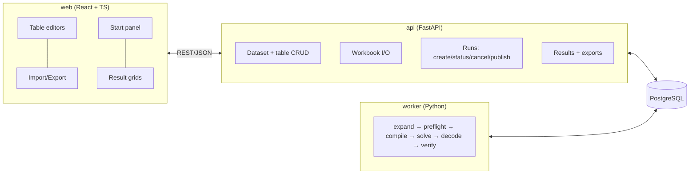

# 06 — Architecture, Stack and Quality Gates

Status: **Authoritative.** The decisions behind this file are in `docs/adr/`.

## 1. Principles

1. Generic core, domain presets (ADR-0001).
2. Data first: everything the engine uses round-trips through the workbook (ADR-0004).
3. Declared vs assigned: the solver writes only run results.
4. Pure pipeline stages, each testable on its own (`05-solver.md` §1).
5. An independent verifier is the source of truth for tests.
6. A fixed constraint catalogue (ADR-0005).
7. Reproducible runs: snapshot, hash, parameters, seed.

## 2. Runtime components



- **Queue:** the `run` table (ADR-0003). The worker claims work with:
  ```sql
  UPDATE run SET status='running', started_at=now(), worker_id=:w
  WHERE id = (SELECT id FROM run WHERE status='queued' ORDER BY created_at
              FOR UPDATE SKIP LOCKED LIMIT 1)
  RETURNING id;
  ```
- **Cancel:** `POST /runs/{id}/cancel` sets `cancel_requested=true`. The worker's callback stops the search (`05-solver.md` §4.5).
- **Stale runs:** runs left `running` with no heartbeat for over 60 s are reset to `queued`, at most twice. After that they become `failed`.

## 3. Backend packages (`backend/src/tts/`)

```
core/            model.py  hierarchy.py  timegrid.py  selectors.py  verifier.py  constraints/<type>.py
expand/          templates.py
preflight/       checks.py
solver/          context.py  compile.py  solve.py  decode.py  explain.py  registry.py  constraints/<type>.py
io/              workbook.py  csvzip.py  fet_html.py  export_html.py  templates/*.html.j2
presets/         academic_weekly/{__init__,types,sheets,labels,defaults}.py   exams/ (Phase 11)
store/           db.py  models.py  repositories.py  migrations/ (Alembic)
api/             main.py  deps.py  routers/{datasets,tables,io,runs,results,validate}.py  schemas.py
worker/          main.py  runner.py
cli.py           `tts` entry point (solve, validate, import-fet, export)
```

**Dependency rules.** Enforced by `tests/unit/test_architecture.py`, which uses import-linter or an AST walk.

| Package | May import |
|---|---|
| `core` | stdlib, pydantic |
| `expand`, `preflight` | `core` |
| `solver` | `core`, ortools |
| `io` | `core`, `presets` (sheet definitions only), openpyxl, bs4, jinja2 |
| `presets` | `core` |
| `store` | `core`, sqlalchemy |
| `api`, `worker`, `cli` | all backend packages |

The core-purity test fails if the domain words listed in `CLAUDE.md` rule 1 appear in `core/`, `solver/`, `expand/` or `preflight/` outside comments and docstrings.

## 4. Database tables

`dataset`, `resource_type`, `resource`, `reference_type`, `reference`, `day`, `period`, `start_pattern`, `availability`, `event`, `event_resource`, `requirement`, `constraint`, `template`, `pin`, `run`, `assignment`, `assigned_resource`, `diagnostic`.

- Their columns follow `02-domain-model.md` §1.
- JSONB columns: `attributes`, `tags`, `params`, `snapshot`, `refs`.
- Every table except `dataset` has a `dataset_id` foreign key, and `(dataset_id, code)` is unique where there's a code.
- `run` columns: `id, dataset_id, status (queued|running|succeeded|blocked|infeasible|invalid|cancelled|cancelled_partial|failed), params, input_hash, snapshot, progress, score, score_breakdown, cancel_requested, worker_id, heartbeat_at, created_at, started_at, finished_at, published`.
- At most one `published=true` run per dataset (partial unique index).

## 5. API (REST, JSON, OpenAPI generated)

| Method and path | Purpose |
|---|---|
| `GET /health` | Liveness |
| `GET/POST /datasets` · `GET/PATCH/DELETE /datasets/{id}` | Manage datasets (`POST` takes `{name, preset}`) |
| `GET /datasets/{id}/schema` | The preset's sheet definitions and labels (drive the UI) |
| `GET/POST /datasets/{id}/tables/{sheet}` | List rows (`?page,size,sort,filter`) / create a row |
| `PATCH/DELETE /datasets/{id}/tables/{sheet}/{code}` | Update / delete a row |
| `POST /datasets/{id}/import` | Multipart `.xlsx` or `.zip`. Returns `{ok, errors[], summary}` |
| `GET /datasets/{id}/export?format=xlsx\|csvzip` | Export the configuration |
| `POST /datasets/{id}/expand?commit=false\|true` | Template preview / commit |
| `POST /datasets/{id}/preflight` | `{issues[]}` |
| `POST /datasets/{id}/runs` | Start a run (`RunParams`). Returns `{run_id}` |
| `GET /runs/{id}` | Status, progress, score, diagnostics |
| `POST /runs/{id}/cancel` · `POST /runs/{id}/publish` | Cancel / publish |
| `GET /runs/{id}/assignments` | Assignment list |
| `GET /runs/{id}/grid?type=<ResourceType>&code=<code>` | Weekly grid JSON for one resource |
| `GET /runs/{id}/export?format=html\|xlsx\|csv&type=&code=` | Result export |
| `GET /runs/{a}/diff/{b}` | Events that moved between runs |
| `POST /validate` | Upload a workbook, with assignments or a FET HTML export. Returns violations |

Errors use the shape `{"error": {"code": str, "message": str, "details": any}}`.

## 6. Front end (`web/src/`)

```
api/          generated schema.ts + thin fetch client
components/   domain-neutral UI (DataTable, RefSelect, MultiRefSelect, ErrorList, …)
features/
  datasets/   list, create from preset
  tables/     schema-driven sheet tabs + editors
  io/         import/export panel with row-level errors
  preflight/  issues panel with links to rows
  runs/       start panel, progress, runs list, diff, publish
  grids/      weekly grid (multi-period cells, joint events), resource picker
routes.tsx
```

## 7. Technology stack

| Area | Choice |
|---|---|
| Backend language | Python 3.12 |
| Package manager | uv |
| Solver | OR-Tools CP-SAT |
| Models and validation | Pydantic v2 |
| API | FastAPI + Uvicorn |
| ORM and migrations | SQLAlchemy 2 + Alembic |
| Database | PostgreSQL 16 (SQLite for unit and integration tests) |
| Spreadsheet I/O | openpyxl, with pandas for bulk checks where useful |
| FET import | beautifulsoup4 |
| HTML export | Jinja2 (WeasyPrint for PDF later) |
| Front end | React + TypeScript (strict) + Vite |
| Tables | TanStack Table with virtualisation |
| Server state | TanStack Query |
| UI | Tailwind CSS + shadcn/ui |
| API types | openapi-typescript |
| Python quality | ruff, mypy (strict on `core`), pytest, hypothesis |
| JS quality | eslint, prettier, vitest, Playwright |
| Packaging | Docker Compose: `db`, `api`, `worker`, `web` |
| CI | GitHub Actions |

Pin exact versions in `backend/pyproject.toml` and `web/package.json` during Phase 0, and record them in `docs/STATUS.md`.

## 8. Quality gates (CI must enforce)

1. Lint and format: `ruff check`, `ruff format --check`, `eslint`, `prettier --check`.
2. Types: `mypy src` (strict on `core`), `tsc --noEmit`.
3. Architecture: the dependency rules and the core-purity test (§3).
4. Catalogue completeness: every type in `04-constraints.md` has `core` and `solver` modules plus tests.
5. Workbook round trip on every fixture.
6. Verifier agreement: every solver result in the tests has zero hard violations.
7. L6 regression (`backend/tests/fixtures/l6/`), all of:
   - The import matches `expected.json`.
   - The original placements verify with 0 violations.
   - The unpinned solve is feasible within NFR-1.
8. Property tests: random small datasets solve and verify.
9. `scale`-marked tests run nightly, not on every push.

## 9. Security and operations (v1)

- Single institute and a single admin account (env-configured credentials, session cookie). Roles come later.
- Upload limit of 20 MB. openpyxl reads in read-only mode and never evaluates formulas.
- Config comes only from env vars (`TT_DATABASE_URL`, `TT_ADMIN_USER`, `TT_ADMIN_PASSWORD_HASH`, `TT_WORKERS`). `.env.example` is committed and `.env` is never committed.
- Structured JSON logs. Solver statistics are stored on the run.
