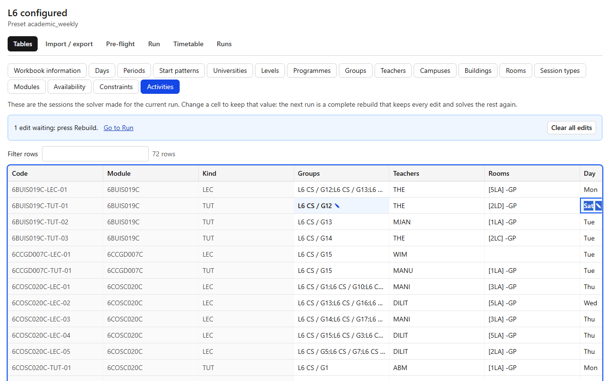

# Activities

## What it's for

In a dataset built from configuration, the **Activities** tab (the last tab of the Tables page) shows the timetable the solver made: one row per **session**, with its groups, teachers, rooms, day and start. You do not type these rows. The solver makes them from your [modules](../tables/Modules.md) and [session types](../tables/SessionTypes.md), and this tab is where you look at them and correct the ones you want to keep.

A correction is an **edit**. The next run is a **complete rebuild** that keeps every edited value and solves everything else again from scratch. Nothing is patched in place.

## How to use it

1. Solve the dataset on the [Run](run.md) tab. Until then the tab says `Nothing solved yet: press Start on the Run tab`.
2. Open **Tables**, then the **Activities** tab. The table shows the sessions of the dataset's current run: the **published** run, or else the latest run that has a timetable.
3. To keep a value, change its cell (double-click, or press Enter or F2). You can change a session's **Groups**, **Teachers**, **Rooms**, **Day** and **Start**. The Code, Module, Kind and End columns are grey because they follow from the others.
4. The cell is marked with a pencil (✎) and a blue background, and a blue message says `1 edit waiting: press Rebuild.`
5. Every edit is **checked at once**. If it makes a clash (two sessions in the same room at the same time, say), the list **Clashes in the timetable with your edits** appears and the sessions involved turn red. Nothing is stored in the run: the check only looks at the run with your edits put on top.
6. Go to the [Run](run.md) tab. The button now says **Rebuild**. Press it. The new run keeps every edited value.

### What an edit keeps

Changing any cell of a session keeps **the session's groups together**, because the groups in a session are decided as a block. Whatever else you changed is kept too. What you did not change stays free, and the solver may move it on the next run.

An edit is kept **by the session's code** (for example `6SENG005C-TUT-02`). A rebuild numbers sessions again, so an edited session keeps its code and the others may be numbered differently.

### Undo

- **Undo edit** at the end of an edited row forgets that session's edit. The next run is free to place it again.
- **Clear all edits** in the blue message forgets them all.

### If an edit no longer fits

If you change the configuration after editing (for example, a group is no longer in the module), the edit stays, and [Pre-flight](preflight.md) names it: `edit_outside_demand` or `edit_too_large`. Undo it, or change the configuration back.

### What the exports show

The exports on the [Timetable](timetable.md) tab show the timetable of a run, and a run made after an edit contains the edited values, so they show them. Nothing in an export is marked as an edit. The **configuration workbook** on the [Import / export](import-export.md) tab holds no sessions and no edits at all.

## Example

On the L6 configuration (`backend/tests/fixtures/l6-config/l6-config.xlsx`): solve it, open **Activities**, and move a tutorial to another **Day**. The row shows a pencil, and `1 edit waiting: press Rebuild.` appears. Press **Rebuild** on the Run tab. The tutorial is still on the day you chose, and other sessions may have moved.

## Related

- [Tables](tables.md)
- [Run](run.md)
- [Timetable](timetable.md)
- [Session types](../tables/SessionTypes.md) and [Modules](../tables/Modules.md)
- [Pre-flight issues](../troubleshooting/preflight-issues.md)
