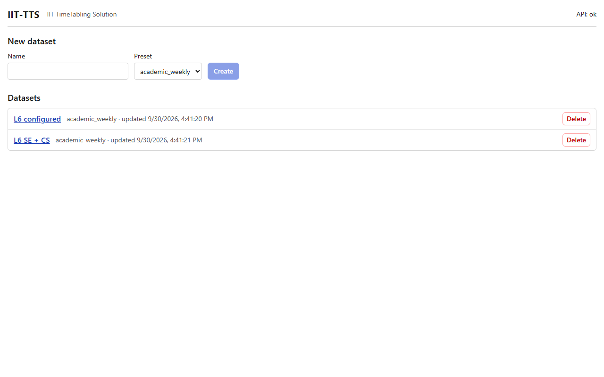

# Datasets (the home page)

## What it's for

A **dataset** holds everything for one timetable: the tables you fill in, and every run made from them. Make one dataset for each term, or for each exam session. Datasets do not affect each other, except that a published timetable can reserve shared teachers and rooms (see [Run](run.md)).

The home page lists your datasets and lets you create and delete them.

## How to use it

1. Under **New dataset**, type a **Name**, for example `2026 Autumn`.
2. Choose a **Preset**.
   - `academic_weekly`: a weekly timetable of lectures and tutorials.
   - `exams`: an exam session.

   The preset decides which tables the dataset has and what they are called. You cannot change it afterwards.
3. Press **Create**. The new dataset appears in the **Datasets** list.
4. Click the dataset's name to open it. You land on the [Tables](tables.md) tab. The other tabs are along the top of the page: [Import / export](import-export.md), [Pre-flight](preflight.md), [Run](run.md), [Timetable](timetable.md) and [Runs](runs.md).
5. To remove a dataset, press **Delete** on its row and confirm. This also deletes all of its runs, and it cannot be undone.

## What a new dataset contains

A new dataset is almost empty.

- It has the preset's tables, all without rows, except that an **academic_weekly** dataset already holds its default preferences in the Constraints table (`AC-GAPS`, `AC-TGAPS` and an inactive `AC-TRAVEL`). See [Default constraints](../constraints/defaults.md) for what they do.
- It has **no days, no periods and no start patterns**. Fill in the Days, Periods and Start patterns tables first, or import a workbook that has them.

The fastest way to start is to import a workbook (see [Import / export](import-export.md)). The repository has two samples you can try: `backend/tests/fixtures/l6/l6.xlsx` for the academic preset and `backend/tests/fixtures/exams/exams.xlsx` for the exams preset.

## Example

Name `L6 SE + CS`, preset `academic_weekly`, then import `l6.xlsx`. The dataset then holds the groups, teachers, rooms and 77 activities of the sample.

## Related

- [Tables](tables.md)
- [Import / export](import-export.md)
