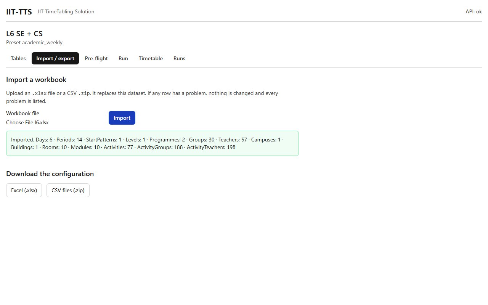

# Import / export

## What it's for

This tab moves a whole dataset in and out of the app as an **Excel workbook** (`.xlsx`) or a set of **CSV files** in a `.zip`. Use it to:

- start a dataset from a workbook you already have, or from a sample,
- edit a large table in Excel and bring it back,
- keep a copy of the data, or hand it to someone else.

## How to use it

### Import

1. Open the **Import / export** tab.
2. Under **Import a workbook**, press **Workbook file** and choose an `.xlsx` file or a CSV `.zip`. The file can be up to 20 MB.
3. Press **Import**.
4. The result is one of two things.
   - A green message `Imported.` followed by how many rows each sheet had, for example `Days: 6 · Periods: 14 · Groups: 30 · Teachers: 57 · Rooms: 10 · Activities: 77`.
   - A red list headed **Nothing was imported**, with **every** problem found, grouped by sheet. Each line reads `Sheet!R<row>C<column> [column]: message`, for example `ActivityGroups!R12C2 [group]: unknown code "L6 SE / G12"`. It means sheet `ActivityGroups`, row 12, column 2. Fix these in your file and import again.

Things to know:

- **An import replaces the dataset's tables.** Whatever was in the tables before is gone, **including the default constraints** a new academic dataset starts with. If your workbook has no rows in its Constraints sheet, the dataset has no constraints after the import. Runs you already made are kept, because each run holds its own copy of its data.
- The import is **all or nothing**. If any row has a problem, nothing changes, and the list shows every problem at once, not just the first.
- A workbook's `format_version` decides which sheets it may have: a version 2 file with an Activities or Templates sheet is refused as `unknown sheet`.
- A workbook must belong to the dataset's preset. A workbook from the other preset is refused with messages such as `Periods: unknown sheet`.
- A `format_version` in the `_meta` sheet that this app does not support is refused.
- A file that is not a real workbook is refused with `workbook: not a valid .xlsx file`.

### Export

Under **Download the configuration**, press **Excel (.xlsx)** or **CSV files (.zip)**. The file holds the dataset's tables as they are now. It does not hold the result of a run. For a run's timetable, use the exports on the [Timetable](timetable.md) tab.

The exported Excel file has:

- one sheet per table, in the order of the workbook format, with `_meta` first;
- a frozen header row;
- drop-down lists on the columns that refer to another table or have a fixed set of values.

### What the workbook holds

The workbook of a dataset built from configuration (format version 2) holds **the configuration only**: days, periods and start patterns, levels, programmes, groups (with their optional modules), teachers (with the modules they teach), rooms, session types, modules, availability and constraints. It holds **no sessions and no edits**: the sessions are the solver's output and live in the app. Import a workbook into a new dataset and you get the same configuration with no edits.

A **format version 1** file (for example `l6.xlsx`) has the activities typed in. It imports as a **hand-made** dataset, and exports as version 1 again. A version 1 file whose Templates sheet has rows is accepted too: the template rows are expanded once into activities when the file is imported, and the dataset keeps no templates.

### Edit in Excel and bring it back

1. Export to Excel.
2. Edit the cells. Keep the header row and the sheet names exactly as they are. You may add columns whose header starts with `x_` for your own notes: they are kept and ignored.
3. Save, then import the file again.

An exported file imported again gives the same data. (In a hand-made dataset the exported Activities sheet does not have the `groups` and `teachers` columns: the two sheets **ActivityGroups** and **ActivityTeachers** hold that information, one row per pairing. When you type a *new* version 1 file, you may add `groups` and `teachers` columns to Activities, listing codes separated by `;`, and they are turned into those rows on import.)

## Example

1. Create a dataset with the `academic_weekly` preset.
2. Import `backend/tests/fixtures/l6/l6.xlsx`.
3. The green message lists the counts. Open the Tables tab to see the data.
4. Export to Excel, change a room's `capacity`, import the file again, and see the change in the Rooms table.

## Related

- [Basics](../basics.md)
- [Tables](tables.md)
- [Pre-flight](preflight.md)
- [Import and editing errors](../troubleshooting/import-errors.md)
