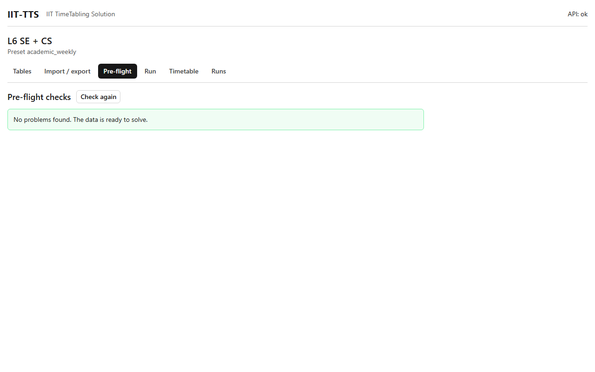

# Pre-flight

## What it's for

Pre-flight checks your data **before** solving, in a fraction of a second. It finds the problems that would make a timetable impossible or pointless, and tells you which rows to fix. It is much faster than finding out from a failed run.

## How to use it

1. Open the **Pre-flight** tab. The checks run by themselves, and run again each time you open the tab. Press **Check again** after you change data.
2. Read the result.
   - A green message, **No problems found. The data is ready to solve.**
   - Or a list of messages. Each one shows:
     - **Error** (red) or **Warning** (amber);
     - the *kind* of check, in grey, for example `no_candidate`;
     - a sentence saying what is wrong, naming the rows by their codes;
     - links such as `6COSC023C-LEC-01 → Activities`.
3. Click a link to jump to the **Tables** tab, with the right table open and the row highlighted in yellow. Fix it there, then come back and press **Check again**.

## Errors and warnings

- An **error** means the data cannot produce a valid timetable. While there is any error, the **Run** tab refuses to start: it shows `Pre-flight found errors, so a run cannot start` and disables **Start**.
- A **warning** is a hint. It never blocks a run. It points at something that is probably not what you meant, or that will make the solver work harder.

## What it checks

| Check | Kind | Severity | Example message |
|---|---|---|---|
| A reference that matches no row | `unknown_reference` | error | `event "…": unknown resource "L6 SE / G12"` |
| A loop in the parent links | `hierarchy_cycle` | error | `resource "L6 SE / G1": parent cycle: …` |
| No start that fits the activity | `empty_start_domain` | error | `6SENG005C-TUT-03: no allowed start fits duration 2` |
| No room that could hold an activity | `no_candidate` | error | `6COSC023C-LEC-01: no Room matching "tag:room_type=auditorium" with capacity ≥ 210` |
| A group, teacher or room needed for more periods than it has | `over_demand` | error | `Teacher HAWE: needs 16 periods, 12 available` |
| Two activities pinned to the same room and time | `conflicting_pins` | error | `Pins: 2 activities pinned to [2LA] -GP on Wed P01` |
| A selector that cannot be read | `invalid_selector` | error | `C-GAPS: scope "teacher:": …` |
| A constraint whose parameters are not valid | `invalid_constraint` | error | the reason, naming the constraint code |
| A kind of room that is nearly used up | `pooled_pressure` | warning | `Room tag:room_type=lab: 64 periods needed, 60 available` |
| A resource nothing can use | `unused_resource` | warning | `Room [1LA] -GP is never a candidate` |
| A constraint whose scope matches nothing | `empty_scope` | warning | `C-GAPS: scope matches nothing` |

Duplicate codes, unknown attributes and the other rules of the data model are reported under their own kinds (`duplicate_code`, `unknown_attribute`, and so on). The troubleshooting pages list them all.

"Available" means the periods that are not breaks, minus the periods the resource is marked `unavailable`. "Needed" is the sum of the durations of the activities that occupy the resource. The troubleshooting pages explain every message and how to fix it.

## Example

An L6 workbook in which the teacher `HAWE` is marked unavailable on every day reports `Teacher HAWE: needs … periods, 0 available` with a link `HAWE → Teachers`. Clicking it opens the Teachers table at that row, and the Availability table is where you remove the rows that blocked them.

## Related

- [Tables](tables.md)
- [Run](run.md)
- [Constraints](../constraints/README.md)
