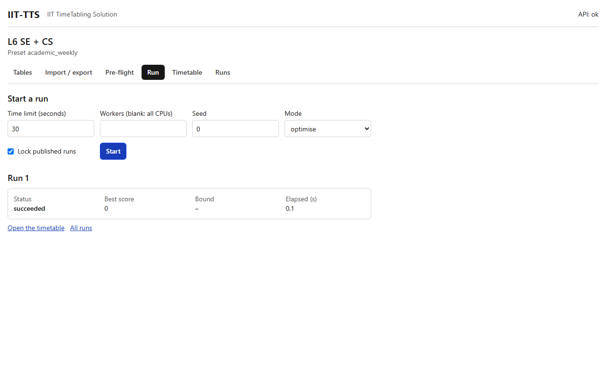

# Run

## What it's for

The Run tab starts the solver and shows how it is getting on. The solver places every activity in a day and period and chooses the rooms, so that nothing is double-booked and every hard rule holds. If you have soft rules, it then tries to lower the score.

Every run saves a frozen copy of the data it used. Changing your tables afterwards does not change the run.

## How to use it

1. Open the **Run** tab. If pre-flight found errors, a red message says so and **Start** is disabled. Follow **See the problems**, fix them, and come back.
2. Set the options (see below), or leave the defaults.
3. Press **Start**. A **Run** section appears with the progress.
4. Wait for the status to reach a final state. You can close the page and come back: the run goes on in the background, and the [Runs](runs.md) tab lists it.
5. When it is done, follow **Open the timetable**, or **All runs**.
6. To stop early, press **Cancel**. The button then says `Cancelling…`.

## The options

| Option | Default | What it does |
|---|---|---|
| **Time limit (seconds)** | 120 | The most time the solver may spend. A small dataset finishes in a fraction of a second and stops by itself. A large one uses the time to improve the score. |
| **Workers (blank: all CPUs)** | blank | How many processor cores to use. Blank uses all of them. |
| **Seed** | 0 | Starts the search from a different place. Two seeds can give two different timetables of the same quality, which is handy for comparing runs. |
| **Mode** | `optimise` | `optimise` searches for the best score until the time limit. `feasible` stops at the first valid timetable. `two_phase` first finds a valid timetable, then improves it with the time left. Without soft rules the three behave alike. |
| **Lock published runs** | on | Respects the published timetables of **other datasets** on teachers, rooms or groups that they share with this one, so the two timetables never clash. See [Runs](runs.md). |

There is one more option, `stage_scope`, for solving a large institute in stages (for example one level at a time). It is available from the command line and the API, and is not on this page.

## Reading the progress

While the run is going, four figures update every second:

- **Status**: where the run is (see below).
- **Best score**: the score of the best timetable found so far. Lower is better, and `0` means every soft rule is met.
- **Bound**: the lowest score the solver still thinks is possible. When best score and bound meet, the timetable is proven best.
- **Elapsed (s)**: time used so far.

When the run is finished and you have soft rules, a **Score breakdown** table (see [Constraints](../constraints/README.md)) shows, for each soft constraint, its **Penalty** (how much it was broken), its **Weight** and the **Score** (penalty × weight), largest first. It tells you which rule to look at if the score is not what you hoped.

## Statuses

[Run statuses and messages](../troubleshooting/run-statuses.md) explains each one in more detail.

| Status | Meaning |
|---|---|
| `queued` | Waiting for a free worker |
| `running` | The solver is working |
| `succeeded` | A valid timetable was found and checked |
| `infeasible` | No timetable can satisfy all hard rules. **Why it did not finish** lists the conflicting rules |
| `blocked` | Pre-flight found errors, so the solver never started |
| `cancelled partial` | You cancelled, and the best timetable found so far was kept |
| `cancelled` | You cancelled before any timetable existed |
| `invalid` | The solver's answer failed the independent check. This should never happen. Please report it |
| `failed` | Something went wrong inside the run |

## Example

On the L6 sample (77 activities), Start with the defaults. The run is `queued`, then `running`, then `succeeded` in well under a minute. With the academic default constraints, the score is shown as `0` when every preference is met.

## Related

- [Pre-flight](preflight.md)
- [Timetable](timetable.md)
- [Runs](runs.md)
- [Run statuses and messages](../troubleshooting/run-statuses.md)
- [Infeasible runs](../troubleshooting/infeasible.md)
