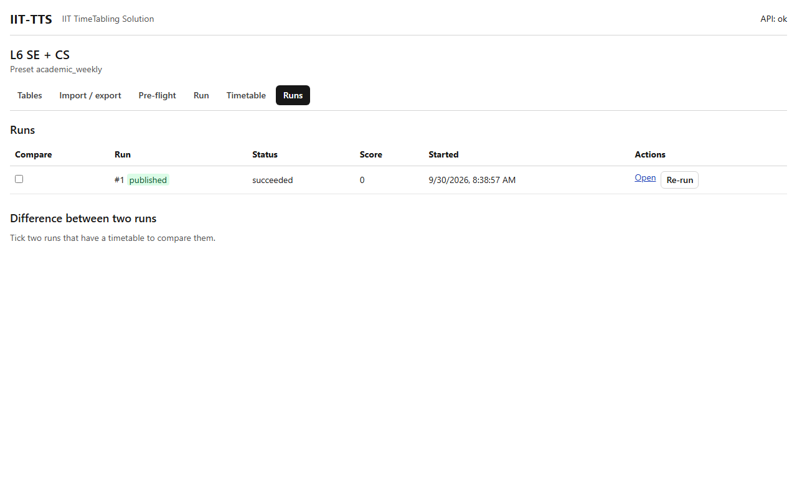

# Runs

## What it's for

The Runs tab is the history of every solve of this dataset. Use it to find an earlier result, compare two runs, choose the **published** one, and start a run again with the same settings.

## How to use it

### The list

Each row is a run:

| Column | Meaning |
|---|---|
| **Compare** | A checkbox, for runs that have a timetable |
| **Run** | The run's number. A green **published** mark shows the official run |
| **Status** | `queued`, `running`, `succeeded`, `infeasible`, `cancelled partial` and so on. See [Run](run.md) |
| **Score** | The weighted score of the soft constraints. Lower is better, `0` is perfect. A dash means there is none |
| **Started** | When the run was created |
| **Actions** | **Open**, **Publish**, **Cancel** and **Re-run** |

### Open

**Open** shows the run's timetable in the [Timetable](timetable.md) tab. It is offered for runs that have one.

### Publish

1. Press **Publish** on the run you want to keep as the official timetable.
2. The run gets the green **published** mark. A dataset has **at most one** published run, so publishing another one removes the mark from the first.

Only a run with a timetable can be published. The published run is the one the Timetable tab opens first. It also matters to other datasets: when you start a run in another dataset that shares teachers, rooms or groups with this one, and **Lock published runs** is on, that run keeps away from the times this published run uses. So publish only timetables you intend to use.

### Compare two runs

1. Tick **Compare** on two runs. A third tick replaces the oldest of the two.
2. Under **Difference between two runs**, read the line `Run #A → run #B: N event(s) differ`, then the table:

| Change | Meaning |
|---|---|
| `moved` | The activity is on a different day or period |
| `resources` | Same time, but a different room |
| `added` | The activity has a place in B and none in A |
| `removed` | The activity has a place in A and none in B |

The **Before** and **After** columns show the day, the start period and the rooms.

### Re-run

**Re-run** starts a new run with exactly the settings of that run (time limit, workers, seed, mode, lock published), on the **current** data. You are taken to the Run tab to watch it. To get a different timetable instead, start a run from the Run tab with another seed.

### Cancel

**Cancel** appears on a run that is queued or running, and stops it. A run that already has a timetable keeps the best one found (`cancelled partial`).

## Example

Run the L6 sample twice with seeds 1 and 2. Both succeed. Tick both under Compare: the table lists the activities the second seed placed differently. Publish the one you prefer.

## Related

- [Run](run.md)
- [Timetable](timetable.md)
- [Run statuses and messages](../troubleshooting/run-statuses.md)
