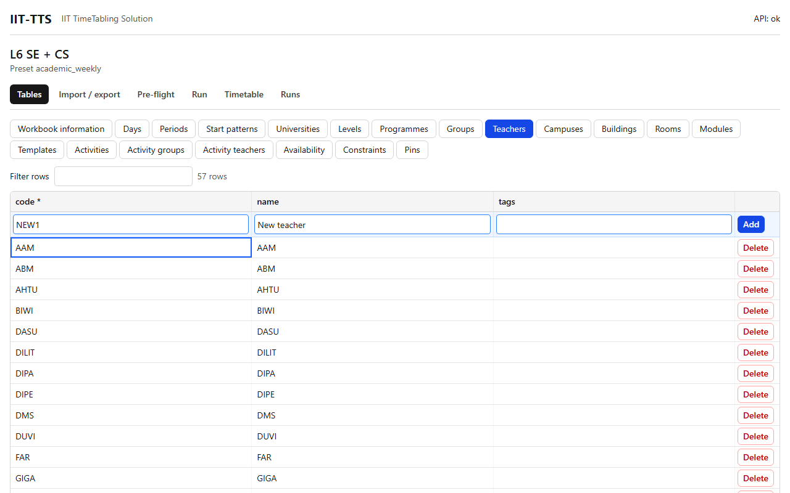

# Tables

## What it's for

The Tables tab is where you enter and correct your data. It has **one tab per table** (Days, Periods, Groups, Teachers, Rooms, Activities and so on). The names come from the preset. Each table is described on its own page in the table reference.

Everything you change here is checked straight away by the same rules as an import, and saved. There is no Save button.

## How to use it

### Move between tables

Click a table's name in the row of tabs above the grid. Tables that are built by the program (the Assignments of a run) are not listed. To generate activities from templates, see [Templates and Expand](templates-expand.md).

### Add rows with the entry row

The blue row **directly under the column headers** is always there. It stays in view while you scroll.

1. Click the first field (or just press Tab until you reach it) and type.
2. Press **Tab** to go to the next field. **Shift+Tab** goes back.
3. Press **Enter**, in any field, to add the row.
4. The fields are cleared and the cursor goes back to the **first field**, ready for the next row. Type, Tab, Enter, and repeat.

Details:

- Columns marked `*` in the header are required. The field's label says `(required)`.
- Leaving a field with Tab never adds the row. Only Enter (or the **Add** button) does.
- **Esc** clears everything you have typed in the row.
- Pressing Enter on an empty row does nothing.
- A choice (a drop-down) and a checkbox keep their value from row to row, because they usually repeat. Everything else is cleared.
- A checkbox starts at the column's default. For example, `active` starts ticked.
- Columns you cannot type (derived columns) and your own `x_` note columns are left out of the entry row. Note columns can be edited in the grid afterwards.
- Lists, tags and JSON are typed as text in the entry row: `HAWE;HARR` for a list, `floor=2;wing=B` for tags, `{"max": 2}` for JSON.
- If the row is refused, what you typed stays. The reason is shown above the table, and the cursor goes to the field the message is about. Correct it and press Enter again.

### Edit a cell

1. Click a cell to select it, or move with the arrow keys. **PageUp** and **PageDown** move ten rows.
2. Press **Enter** or **F2**, or double-click, to edit.
3. Type the new value and press **Enter** to keep it, or **Esc** to cancel.

The new value shows immediately and is checked by the server. If it is refused, the editor opens again with your text and the reason.

What the editor looks like depends on the column:

| Column holds | Editor |
|---|---|
| Text or a whole number | A text box |
| One of a fixed set of values (for example `mode`) | A drop-down |
| One code from another table (for example a room's `building`) | A text box that suggests the codes of the other table as you type |
| Several codes (for example an activity's `teachers`) | A checklist with a filter box. Tick the codes, then press **Done** |
| Tags | One row per `key` and `value`, with **Add tag** and a remove button. Press **Done** when finished |
| JSON (constraint `params`) | A text area that tells you when the JSON is not valid. **Done** is disabled until it is |
| True or false | A checkbox. Press Enter or double-click to switch it, with no editor |

### Delete a row

Press **Delete** at the end of the row and confirm.

A row cannot be deleted while other rows still refer to its code. The delete is refused, nothing changes, and the rows that still refer to it are listed above the table (for example `ActivityTeachers!R2C2 [teacher]: unknown code "HAWE"`). Delete or correct those rows first, then delete this one.

### Find rows

- Type in **Filter rows** to show only rows that contain the text in any column. The counter beside it shows how many rows match, for example `12 of 480 rows`.
- Click a column header to sort by that column. Click again to reverse it, and once more to go back.
- Tables of thousands of rows scroll smoothly, because only the rows in view are drawn.

### Follow a link from another tab

A pre-flight message that names a row links here, opens the right table and highlights the row in yellow.

## Example

To add three teachers to the Teachers table: click the `code` field of the entry row, type `AB`, press Tab, type `Ada B`, press Enter. The row appears below the entry row and the cursor is back in `code`. Type `CD`, Tab, `Cy D`, Enter. Then `EF`, Tab, `Eve F`, Enter.

## Related

- [Templates and Expand](templates-expand.md)
- [Import / export](import-export.md)
- [Basics](../basics.md)
