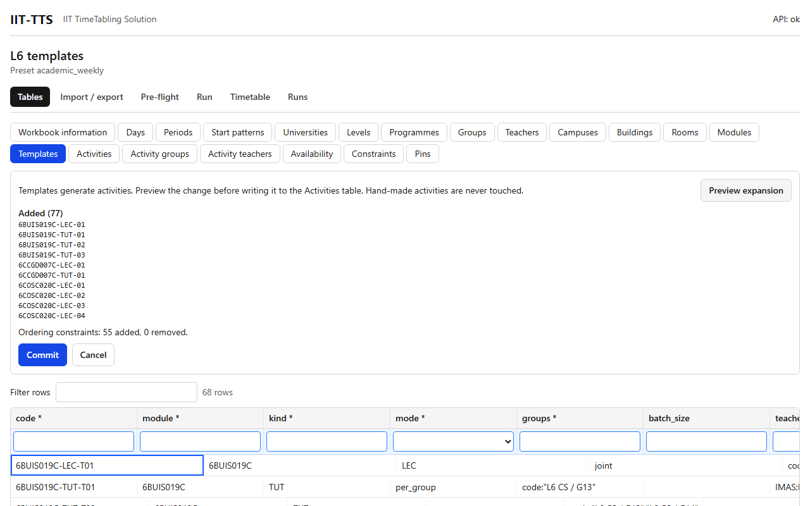

# Templates and Expand

## What it's for

Typing every lecture and tutorial by hand is slow. A **template** is one row that says "this module has a session like this, for these groups". **Expand** turns the templates into rows of the Activities table. You can preview what it would change before it writes anything.

The Expand panel appears above the grid when you open the **Templates** table.

## How to use it

1. Fill in the Templates table (see the Templates page of the table reference). Each row names a module, a kind such as `LEC` or `TUT`, a **mode**, the **groups** it is for, the teachers, the duration and start pattern, the room type, and how many sessions per week.
2. Press **Preview expansion**. Nothing is written yet.
3. Read the preview:
   - **Added**: activities that would be created.
   - **Changed**: activities whose details would change.
   - **Removed**: activities that would be deleted because their template no longer produces them.
   - **Ordering constraints**: how many automatic "lecture before tutorial" rules would be added or removed.
   - A red list of **problems**, if a template cannot be expanded (for example a `groups` selector that cannot be read, or mode `batched` with no `batch_size`). That template is skipped and the others are still expanded.
4. Press **Commit** to write the changes, or **Cancel** to leave the data as it is. After a commit you see a summary such as `Expanded: 40 added, 0 changed, 0 removed.`
5. If the preview says `The activities already match the templates`, there is nothing to do.

## What the mode means

| Mode | Activities made for each of the `sessions_per_week` |
|---|---|
| `joint` | One activity, attended by all the groups the `groups` selector matches together |
| `per_group` | One activity for each matched group |
| `batched` | The matched groups are sorted by code and cut into consecutive batches of `batch_size`. One activity per batch |

The activities are called `<module>-<kind>-<nn>`, for example `6SENG005C-TUT-03`. The number counts from `01` in creation order, and the codes stay the same when the inputs do not change.

## Rules you can rely on

- **Hand-made activities are never touched.** Expand only creates, changes and removes activities that carry the name of a template in their `template` column.
- **Expanding twice changes nothing.** The second preview says the activities already match.
- **Lecture before tutorial.** For a module that has both a `LEC` template and a `TUT` template, Expand adds a soft ordering rule (weight 1) from each lecture to each tutorial that shares at least one group. These rules have codes that start with `AUTO-ORDER:` and are managed by Expand. Do not edit them by hand.
- Editing a template and expanding again updates only the activities of that template.
- A template with `active` set to false makes no activities. Its old activities show up as **Removed** at the next expansion.
- A `groups` selector that matches no group simply makes no activities for that template.

## Example

In the L6 sample written as templates, `6BUIS019C-LEC-T01` (kind `LEC`, mode `joint`) makes the module's lecture for all its groups, and tutorial templates such as `6BUIS019C-TUT-T01` (kind `TUT`, mode `per_group`, `groups` = `code:"L6 CS / G13"`) make tutorials. Previewing the whole sample shows **Added (77)**, the same 77 activities as the hand-typed sample, and `Ordering constraints: 55 added, 0 removed`.

## Related

- [Tables](tables.md)
- [Pre-flight](preflight.md)
