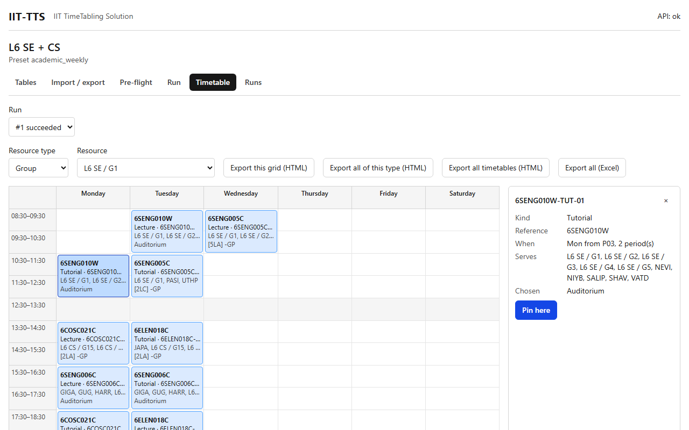

# Timetable

## What it's for

The Timetable tab shows the result of a run as a **weekly grid** for any group, teacher, room or other resource, lets you **pin** an activity where it is, and exports the timetables as web pages, Excel or CSV.

## How to use it

### Look at a timetable

1. Open the **Timetable** tab, or follow **Open the timetable** from the Run tab.
2. Choose the **Run**. Only runs that have a timetable are listed (`succeeded`, or `cancelled partial`). The **published** run is chosen for you if there is one, otherwise the newest.
3. Choose the **Resource type** (for example Group, Teacher, Room) and then the **Resource** (for example `L6 SE / G1`).
4. The grid shows one column for each day and one row for each period, with the period's start and end time. Grey rows are breaks.

### Read a cell

Each activity is one block:

- **Bold line:** the module (the activity's reference). If there is none, the activity's code.
- **Second line:** the kind, for example `Lecture`, then `·` and the activity's code.
- **Third line:** the groups and teachers the activity is fixed to.
- **Fourth line:** the rooms the solver chose.

An activity that lasts several periods is one tall block that covers all of them. You never see an activity twice.

The timetable of something that groups others, such as a programme or a level, shows the activities of everything below it, so blocks of its different groups may fall in the same period. They are then shown **side by side** in that period, each narrower. That is not a clash: a clash can only happen on a group, teacher or room.

A **joint** activity (attended by several groups together) appears in the timetable of each of those groups, and of their teacher and room, and lists all the groups it serves.

### Pin an activity

Pinning tells the solver to keep an activity where it is in every later run.

1. Click an activity block. A panel **Event details** opens on the right with its kind, reference, the day and start period, the groups and teachers it serves, and the rooms chosen.
2. Press **Pin here**. The day, the start period and the rooms are written as a row of the Pins table, and the panel says `Pinned. Start a new run to apply it.`
3. Start a new run. Pins are applied to new runs only.
4. To release it, click the block again and press **Unpin**.

A pin can be edited by hand in the Pins table. Leave `day` and `start_period` blank to pin only the rooms, for example.

### Export

| Button | What you get |
|---|---|
| **Export this grid (HTML)** | A web page with the week of the chosen resource. Open it in a browser or print it. |
| **Export all of this type (HTML)** | One web page with the weekly grids of every resource of the chosen type, for example every teacher. |
| **Export all timetables (HTML)** | **One single web page with every timetable**: every group, teacher and room that has activities. |
| **Export all (Excel)** | A workbook with the dataset's tables and the run's **Assignments** sheet: one row per activity with day, start, end, rooms, groups, teachers and buildings. |

The single web page is arranged for reading and printing:

- It starts with a **Contents** list, with a section for each type (Group, Teacher, Room) and a link to each resource's timetable.
- Each timetable has a **↑ Contents** link back to the top.
- When printed, each timetable starts on a new page.
- The file is named `run-<number>-all.html`.

Only resources that have at least one activity are included.

## Example

On the L6 sample, choose Resource type **Group** and Resource `L6 SE / G1`. You see the week of the group: the lectures it shares with the other SE groups, and its own tutorials in labs. Press **Export all timetables (HTML)** and open the file: the Contents list links to every group, teacher and room that has activities.

## Related

- [Run](run.md)
- [Runs](runs.md)
- [Tables](tables.md) (the Pins table)
